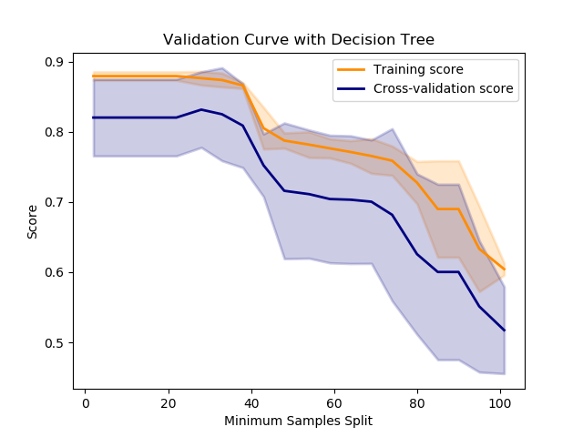
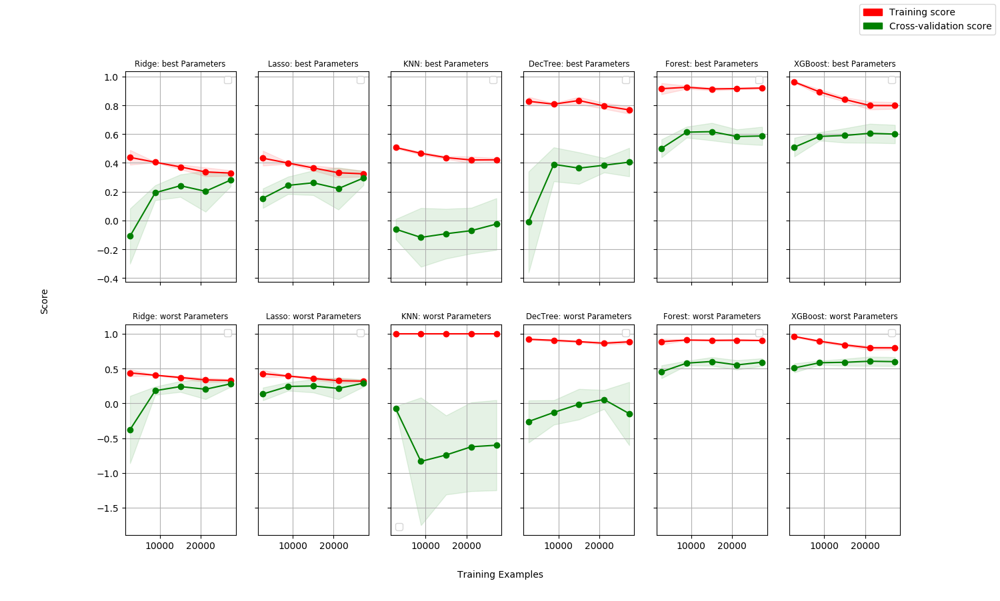

# Eplore ML in Sklearn Wrappers

## Usage

Easily explore parameters and models of sklearn, XGBoost, etc. using a group of helper functions. Run a simulation using the following steps

1. Load Data: i.e. `pd.read_csv(...)`
2. Define Regressors and Parameter Grids: `models = [Regressor("name", RegressorObject, [{'param1':value1},{'param2':value2}])` (see `src/DefineModels.py`)
3. Define DataSettings: `ds = DataSetting(y=data.y, x=data[regressors], models=models.copy(), loss_function=rmse, k=5)
4. Run `evaluate_all()`
5. Plot validation or losses: i.e. `ds.plot_model_validation_curves(path=output_path)

## Advantage

A set of regressors and parameters can easily be extended and experiments can be conducted in a controlled manner. The same settings can be applied to different datasets easily. Easy plots of progress with respect to different variables.

|Example Validation Curve|Example Learning Curves| 
| ------------- |-------------|
|||
## Disadvantage

Parallelisation not implemented. Breaking out of the predefined framework requires reworking the imported classes. 
